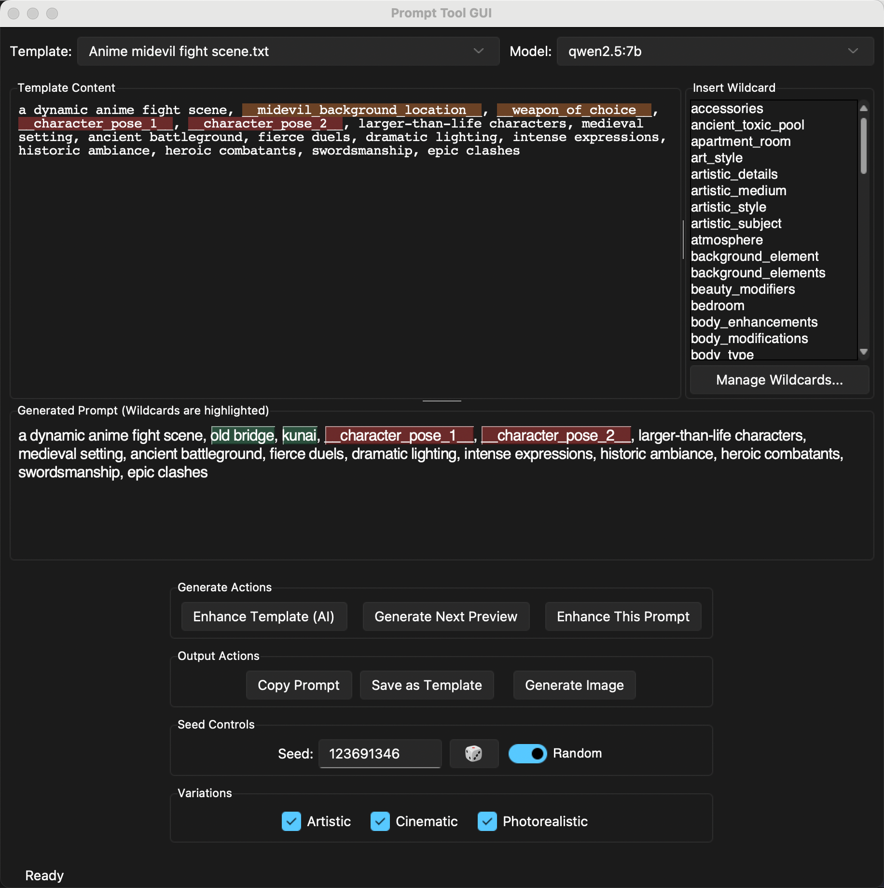

# Prompt Tool GUI

A desktop application for generating and enhancing prompts for Stable Diffusion. It leverages local AI models through Ollama to provide a rich, interactive, and creative environment for prompt engineering, from initial idea to final image generation.

## ✨ Feature Highlights

*   **Prompt Evolver & Conceptual Breeding:** A dedicated window for "breeding" new prompts. Select two or more "parent" prompts, and an advanced AI will deconstruct their core concepts (subject, style, mood) to generate unique, creative "child" prompts. The UI features selectable, word-wrapping prompt cards for a superior user experience.
*   **Full-Featured Wildcard Manager:** A comprehensive tool for managing your wildcard library with a structured editor, AI-powered suggestions and refinement, intelligent refactoring, dependency graphs, and an interactive validator to find and fix errors.
*   **Advanced AI Brainstorming:** A dedicated chat window to brainstorm ideas. Load existing wildcards or templates into the chat to have the AI help you refine them, or generate new content from scratch, including linked wildcards and templates based on your entire library.
*   **Advanced Image Permutations:** Right-click any generated image to instantly create variations with different LoRAs or new random seeds, allowing for rapid, targeted refinement.
*   **Model Usage Statistics:** Get valuable insights into your creative process with detailed statistics and charts on which models you use most and which are the fastest.
*   **Automatic Update Notifications:** The application automatically checks for new versions on startup and will notify you if an update is available, with instructions on how to get it.
*   **Direct Image Generation & History:** Generate images directly from any prompt using a local InvokeAI server. All generations, prompts, and images are saved to a detailed, searchable history viewer with favoriting and image management.
*   **Image to Prompt (Interrogator):** Generate a detailed Stable Diffusion prompt directly from an image using a local vision model (e.g., LLaVA).

<p align="center">
  
</p>

A quick look at some of the key tool windows:

<table align="center">
  <tr>
    <td align="center">Prompt History</td>
    <td align="center">Image Generation</td>
   <!-- <td align="center">AI Brainstorming</td> -->
  </tr>
  <tr>
    <td></td>
    <td></td>
    <!-- <td></td> -->
  </tr>
</table>

## Key Features

*   **Template-Based Generation:** Create complex prompts using simple templates and `__wildcard__` placeholders. Supports advanced syntax like `__!wildcard__` for unique rolls and `__wildcard:N-M__` for selecting multiple items.
*   **Live Preview & Interaction:**
    *   Instantly see a generated prompt and click on wildcard-generated text to swap it with other options from the source file.
    *   Automatically detects missing wildcards in your template and provides clickable links to generate them on the fly.
*   **AI-Powered Enhancement & Variations:**
    *   Use a local LLM to enhance your base prompts, adding detail, style, and quality keywords.
    *   Generate cinematic, artistic, and photorealistic variations of your enhanced prompt.
*   **Interactive Template Editor:**
    *   Right-click context menu to easily add or adjust prompt weighting `(like this)1.2`, de-emphasis `[like this]`, roll for unique values, or select multiple items from a wildcard.
    *   Right-click to "Brainstorm with AI" to get suggestions and refine your template in a dedicated chat window.
    *   Double-click any `__wildcard__` to immediately open it in the Wildcard Manager.
    *   Select any text and right-click to instantly turn it into a new wildcard file.
    *   Drag and drop `__wildcard__` tags to easily reorder your prompt.
    *   Get instant visual feedback for missing wildcards and `requires` clauses that are out of order.
*   **Advanced AI Brainstorming:**
    *   A dedicated chat window to brainstorm ideas. Load existing wildcards or templates into the chat to have the AI help you refine them.
    *   Generate new wildcard files, templates from a concept, templates from *all* your existing wildcards, or even linked wildcard files from scratch.
    *   The AI automatically detects when a generated template or wildcard requires *new* wildcards, and provides clickable links to generate them.
    *   Select any text in the conversation and have the AI rewrite it based on your instructions ("make it more poetic", "add more technical details", etc.).
*   **Full-Featured Wildcard Manager:** A comprehensive tool for managing your wildcard library.
    *   A powerful structured editor to easily manage complex choices with weights, tags, requirements, and includes.
    *   Choices are automatically sorted alphabetically when a file is loaded for a consistent editing experience.
    *   Advanced tools: Find & Replace, Find Similar Choices (fuzzy matching), and Find Duplicates.
    *   **Intelligent Refactoring:** When you rename a wildcard or change a choice's value, the app will offer to scan your entire project and automatically update all other wildcards that depend on it.
    *   Merge multiple wildcard files into a new one, intelligently combining their content.
    *   Scan your entire project to find unused wildcard files that can be archived or deleted.
    *   **Dependency Graph:** View a visual graph of how wildcards depend on each other to better understand your prompt structure.
    *   **Interactive Validator:** Scan all files for errors (e.g., a `requires` clause pointing to a non-existent value). Double-click an error to jump directly to the problematic file and choice, or right-click to fix common issues automatically.
    *   **AI Assistant:** Use AI to suggest new choices, automatically add tags, refine choices with metadata, fix grammar, or check for compatibility between two files.
*   **SFW/NSFW Workflows:** Keep your SFW and NSFW content completely separate. The app dynamically switches template, wildcard, and system prompt directories.
*   **Customizable System Prompts:** Edit the underlying instructions given to the AI for enhancement and variations to tailor its output to your needs.
*   **Comprehensive History Viewer:** Browse, search, and reuse all your past prompts and images. The viewer is filtered by the current workflow, showing only SFW history in SFW mode and only NSFW history in NSFW mode.
    *   Tracks which template was used for each generation.
    *   View generated images with pagination and full generation parameters, including how long each image took to generate.
    *   Mark entries and individual images as favorites.
    *   Set cover images for history entries for easier browsing.
    *   Saves multiple image generations for the same prompt instead of overwriting, allowing for easy comparison.
    *   Directly enhance prompts or regenerate images from the history context menu.
    *   Edit prompts directly in the history view.
    *   **Organized Image Saving:** All images for a history entry are saved into a dedicated subfolder, making them easy to find and manage on your file system.
*   **Direct Image Generation (InvokeAI):** Generate images directly from any prompt using a local InvokeAI server (v3+).
    *   Select multiple models and LoRAs to generate a batch of images for comparison.
    *   **Generate LoRA Permutations:** Right-click any generated image to quickly create and compare variations with different LoRAs and weights in a dedicated preview window.
    *   **Generate Seed Variations:** Right-click any image to generate multiple new versions with different random seeds, and keep as many as you like.
*   **Model Performance Insights:**
    *   View detailed statistics on your model usage, including generation counts and average, minimum, and maximum generation times.
    *   An interactive chart helps you visualize which models are your workhorses and which are the fastest.
    *   Get at-a-glance performance data with tooltips in the image generation dialog showing the average time per model.
*   **Seed Management:** Easily switch between a fixed seed for reproducible results and random seeds for variety.
*   **Modern UI:** Features a clean, modern interface with light and dark themes and adjustable font sizes.
*   **Resource Management:**
    *   Automatically unloads AI models from VRAM when they are no longer active to free up GPU memory.
    *   Proactively cleans up temporary images *and* their thumbnails from the InvokeAI server when you choose not to save them to the gallery, keeping your output directory clean.
    *   Efficient UI: Loading animations and long, filterable lists are optimized to use minimal CPU, keeping the app responsive and your laptop cool.

## Requirements

*   **Python 3.10+**
*   **Ollama** installed and running on your system.
*   At least one LLM pulled in Ollama (e.g., `qwen:7b`, `llama3:8b`). `qwen` models are highly recommended for their creative capabilities.
*   **(Optional) InvokeAI v3.0.0+** installed and running for the "Generate Image" feature.
*   Python libraries as listed in `requirements.txt`.

## Installation & Setup

1.  **Clone the repository:**
    ```bash
    git clone https://github.com/Akashijk/Prompt-Tool
    cd Prompt-Tool
    ```

2.  **Install Ollama:**
    Follow the instructions on ollama.com to install and start the Ollama server.

3.  **Pull an AI Model:**
    Pull a model to be used for enhancement and brainstorming. `qwen` models are highly recommended.
    ```bash
    ollama run qwen:7b
    ```

4.  **Set up a Python Environment (Recommended):**
    ```bash
    python -m venv venv
    source venv/bin/activate  # On Windows, use `venv\Scripts\activate`
    ```

5.  **Install Dependencies:**
    Install the required Python packages using the provided `requirements.txt` file.
    ```bash
    # This will install libraries like Pillow, networkx, matplotlib, and thefuzz,
    # which are needed for image handling, dependency graphs, and advanced wildcard tools.
    pip install -r requirements.txt
    ```

6.  **Directory Structure:**
    The application uses the following directory structure within the project root. You can create these folders and start adding your own `.txt` files.
    ```
    /
    ├── templates/  (.txt files)
    │   ├── sfw/
    │   └── nsfw/
    ├── wildcards/  (.json files)
    │   ├── nsfw/ (for nsfw-only wildcards)
    │   └── ... (shared wildcards go in the root)
    └── system_prompts/ (.txt files)
        ├── sfw/
        └── nsfw/
    ```
    *   **`templates/`**: Contains your prompt templates, organized by workflow.
    *   **`wildcards/`**: Contains your wildcard files in `.json` format. This powerful format supports simple lists, weighted randomization (`"weight": 5`), context-aware choices (`"requires": {"key": "value"}`), dynamic wildcard inclusion (`"includes": ["wildcard_name"]`), and descriptive tags (`"tags": ["tag1"]`) for future filtering and organization. The root folder is for shared wildcards, and the `nsfw` subfolder is for NSFW-specific ones.
    *   **`system_prompts/`**: The application will automatically create default system prompts here. You can edit them via the UI (`Tools -> System Prompt Editor`).

## Usage

1.  **Run the application:**
    ```bash
    # For standard use
    python main.py

    # For verbose mode (prints AI requests/responses to the console)
    python main.py --verbose
    ```
2.  **Main Window Workflow:**
    *   **Workflow:** Choose `SFW` or `NSFW` from the "Workflow" menu. This changes the content available.
    *   **Model:** Select an active Ollama model from the dropdown.
    *   **Template:** Select a template file. The content will appear in the editor.
    *   **Generate:** Click "Generate Next Preview" to see a prompt with wildcards filled in.
    *   **Interact:** In the preview pane, click on any highlighted text to see a menu of other options from that wildcard file. If your template uses a wildcard that doesn't exist, a link will appear below the preview allowing you to generate it.
    *   **Enhance:** When you're happy with the preview, click "Enhance This Prompt". A new window will appear showing the AI's enhanced version and any selected variations.
    *   **Generate Image:** From the main window or the enhancement results window, click "Generate Image". A dialog will appear allowing you to select your InvokeAI model(s), LoRAs, and other settings. The generated images and their parameters will be saved to your history. In the image preview dialog, you can right-click any image to generate further LoRA or seed variations.

3.  **AI Brainstorming (`Tools -> AI Brainstorming`):**
    *   Chat directly with the AI for general ideas or to generate new files from scratch.
    *   Load an existing wildcard or template (via the Wildcard Manager or Template Editor context menu) to have a focused, context-aware conversation about improving it.
    *   Use the "Generate..." buttons to have the AI create new content, including templates from a concept or from all of your existing wildcards.
    *   When the AI generates content that uses a new, non-existent wildcard, it will appear as a clickable link in the chat, allowing you to generate it instantly.
    *   Right-click on text in the conversation to "Rewrite Selection with AI...".

4.  **Wildcard Manager (`Tools -> Wildcard Manager`):**
    *   View all wildcard files for the current workflow.
    *   Select a file to view and edit its contents.
    *   Use the structured editor to manage complex choices, or switch to the raw text editor for direct JSON editing.
    *   Use the AI assistant buttons to suggest new choices, refine existing ones with metadata, or automatically add tags.
    *   Use the full suite of tools to find duplicates, merge files, or validate your entire project for errors.
    *   Click "View Dependencies" to see a visual graph of how your wildcards are interconnected.
    *   Click "Brainstorm with AI" to send the current wildcard list to the chat window for refinement.

5.  **Prompt Evolver (`Tools -> Prompt Evolver...`):**
    *   Select two or more "parent" prompts from your entire generation history.
    *   The AI will "breed" them, blending their core concepts, subjects, and styles to create a new generation of unique "child" prompts.
    *   Use the generated children as new parents for further evolution, send them to the main editor, or right-click to copy, enhance, generate an image, or save them to your history.

6.  **Model Statistics (`Tools -> Model Usage Statistics...`):**
    *   View a detailed table and interactive chart showing which models you use most often and how long they take to generate images.

6.  **Image Interrogator (`Tools -> Image Interrogator...`):**
    *   Select an image from your computer.
    *   Choose a vision-capable model (e.g., LLaVA).
    *   The AI will generate a descriptive prompt based on the image content.

## Configuration

*   **Ollama Server & Directory Paths:** Change the Ollama server URL and the default locations for your `templates`, `wildcards`, and `history` folders via `Tools -> Settings...`.
*   **Theme & Font:** Change the UI theme (Light/Dark) and font size under the `View` menu. Your preferences are saved automatically.
*   **System Prompts:** Modify the core instructions given to the AI via `Tools -> System Prompt Editor`. This gives you fine-grained control over how the AI enhances prompts and creates variations.

## How It Works

*   **Frontend:** Built with Python's standard `tkinter` library and themed with `sv-ttk` for a modern look and feel.
*   **Backend:** Interacts with a local Ollama instance via its REST API. All AI processing happens on your machine.
*   **Workflows:** The SFW/NSFW toggle is a core feature that changes the directories from which templates, wildcards, and system prompts are loaded, ensuring strict content separation.
*   **State Management:** The application tracks model usage across all windows and automatically sends requests to Ollama to unload models from VRAM when they are no longer active, helping to manage system resources.

## Project Architecture

The application is designed with a clear separation of concerns, divided into two main packages: `core` and `gui`.

*   **`main.py`**: The main entry point for the application. It handles command-line argument parsing (like `--verbose`) and initializes the `GUIApp`.

*   **`core/`**: This package contains all the backend logic, decoupled from the user interface.
    *   `prompt_processor.py`: The central orchestrator. It coordinates interactions between the template engine, Ollama client, and history manager.
    *   `template_engine.py`: Manages loading, parsing, and resolving templates and wildcards, including the complex logic for `requires` and `includes`.
    *   `ollama_client.py`: A dedicated client for all communication with the Ollama REST API, handling prompt enhancement, variations, and brainstorming chats.
    *   `history_manager.py`: Handles reading and writing to the prompt history files (which use the `.jsonl` format).
    *   `config.py`: Centralizes all application settings and paths.
    *   `default_content.py`: Stores the default text for system prompts and variations, allowing for easy restoration.

*   **`gui/`**: This package contains all the frontend `tkinter` components.
    *   `gui_app.py`: The main application class (`tk.Tk`). It builds the main window and manages the lifecycle of all other tool windows.
    *   `wildcard_manager.py`, `brainstorming_window.py`, etc.: Each major feature has its own dedicated window class, promoting modularity.
    *   `common.py`, `theme_manager.py`, etc.: Contain reusable components like custom dialogs, tooltips, and theme management logic.

*   **Data Directories**:
    *   `templates/`, `wildcards/`, `system_prompts/`: Store user-customizable content.
    *   `history/`: Stores the generated prompt history.
    *   `assets/`: Contains static assets like the application icon.

*   **`version.txt`**: A simple text file in the project root containing the current version number (e.g., `v1.2.0`). This file is intended to be generated automatically as part of a release process (e.g., `git describe --tags > version.txt`) and is used to provide update notifications for users who download the project as a ZIP file.
## Troubleshooting

Here are solutions to some common issues you might encounter.

### "Ollama server is not running" Error

This is the most common issue. It means the application cannot connect to the Ollama service on your machine.

*   **Solution:**
    1.  Make sure you have installed Ollama from ollama.com.
    2.  Open your terminal or command prompt and run `ollama ps`. If the server is running, you will see a list of models. If it's not, you'll likely get a "connection refused" error.
    3.  If it's not running, start the Ollama application on your system. On macOS and Windows, this is usually a background application. On Linux, you may need to start it with `systemctl start ollama`.

### "Model not found" Error

This error occurs when the application tries to use a model that Ollama doesn't have.

*   **Solution:**
    1.  Open your terminal and run `ollama list` to see which models you have installed.
    2.  If the model you want to use is not in the list, pull it using `ollama run <model_name>` (e.g., `ollama run qwen:7b`).
    3.  Restart the Prompt Tool GUI to refresh the model list.

### Slow AI Responses

The time it takes for the AI to respond depends heavily on your computer's hardware (CPU, RAM, and especially VRAM on your GPU) and the size of the model you are using.

*   **Tips for Better Performance:**
    *   Use smaller models (e.g., 7B models like `qwen:7b` or `llama3:8b`) for faster responses. Larger models (13B+) are higher quality but require more resources.
    *   Ensure no other resource-intensive applications are running.
    *   If you have a dedicated GPU, make sure Ollama is configured to use it.

### Wildcard File Errors

If you see warnings about "invalid JSON" when using the Wildcard Manager, it means a `.json` file has a syntax error.

*   **Solution:**
    1.  In the Wildcard Manager, the file will be loaded into the "Raw Text Editor".
    2.  You can manually fix the syntax (e.g., add a missing comma, fix quotes).
    3.  Alternatively, when you try to save, the application will offer to use an AI to attempt to fix the broken JSON for you.

### "Generate Image" Fails

The "Generate Image" feature requires a running instance of InvokeAI version 3.0.0 or higher.

*   **Solution:**
    1.  Ensure you have InvokeAI v3+ installed and running.
    2.  Go to `Tools -> Settings...` and verify that the "InvokeAI Server URL" is correct (e.g., `http://127.0.0.1:9090`). The application will test the connection and version compatibility when you save.

### Black or Distorted Images (InvokeAI)

Some SDXL models can produce black or garbled images if they are used with a lower-precision (fp16) VAE.

*   **Solution:**
    1.  The tool automatically tries to prevent this by finding a compatible high-precision (fp32) VAE on your system.
    2.  For the best results, ensure you have the standard `sdxl-vae.safetensors` file in your InvokeAI `models/sdxl/vae/` directory. The tool will prioritize using this VAE for maximum compatibility and image quality.

### Platform-Specific Notes

*   **macOS UI Quirks:** Due to the way `tkinter` integrates with native macOS widgets, some UI elements may behave differently. For example, the "Show/Hide Tab Bar" option is disabled on macOS because the native tab control does not support being hidden. The application aims to hide such non-functional options where possible to provide a clean experience.

## Contributing

Contributions are welcome! Please feel free to submit a pull request or open an issue for any bugs or feature requests.

## License

This project is licensed under the MIT License. See the `LICENSE` file for details.